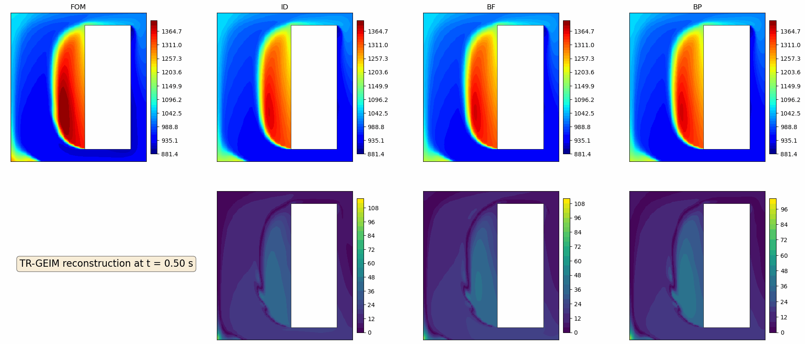
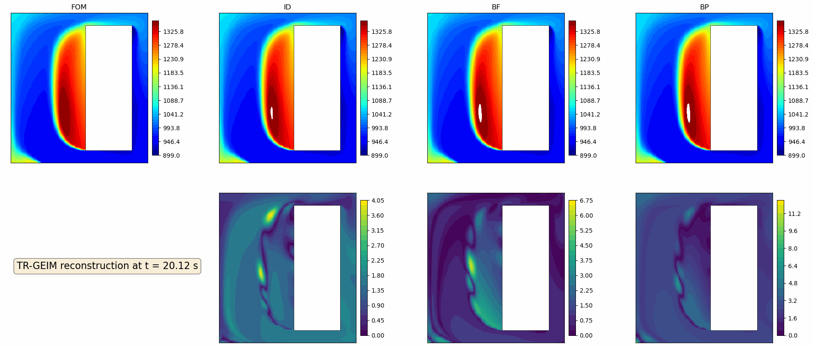
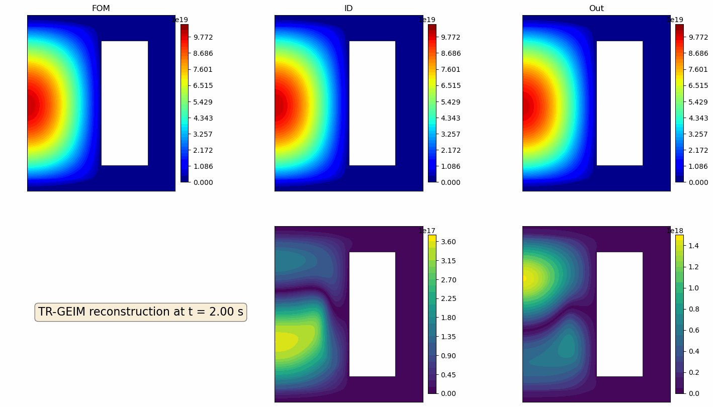
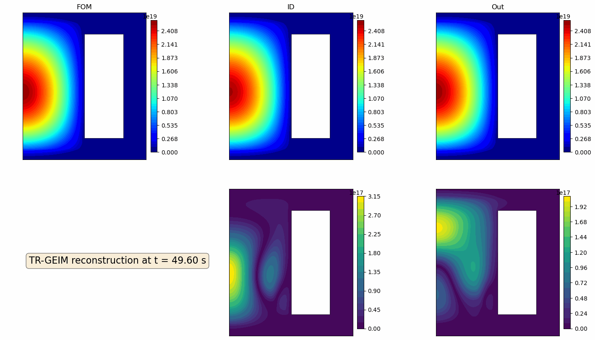
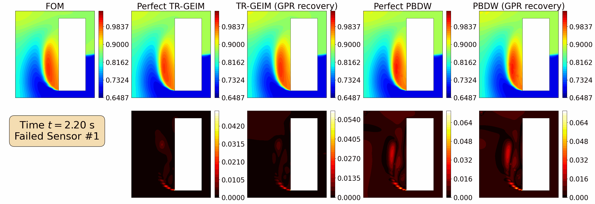

## Boundary Sensing
Comparison of 3 different sensor placement strategies (ideal ID, full boundary BF, and partial boundary BP).

<figure style="display: inline-block; margin: 10px;">
  
  <figcaption style="text-align: center;">(a) Online Reconstruction</figcaption>
</figure>

<figure style="display: inline-block; margin: 10px;">
  
  <figcaption style="text-align: center;">(b) Online Prediction</figcaption>
</figure>

## Reflection Sensing

Comparison of 2 different sensor placement strategies (ideal ID, out-core Refl).

<figure style="display: inline-block; margin: 10px;">
  
  <figcaption style="text-align: center;">(a) Online Reconstruction</figcaption>
</figure>

<figure style="display: inline-block; margin: 10px;">
  
  <figcaption style="text-align: center;">(b) Online Prediction</figcaption>
</figure>

## Failed Sensors
Analysis of the TR-GEIM and PBDW when the first sensor fails.

<figure style="display: inline-block; margin: 10px;">
  
  <figcaption style="text-align: center;">Online Reconstruction</figcaption>
</figure>
