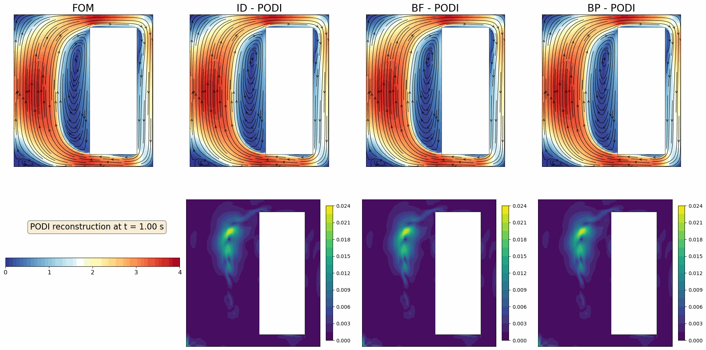
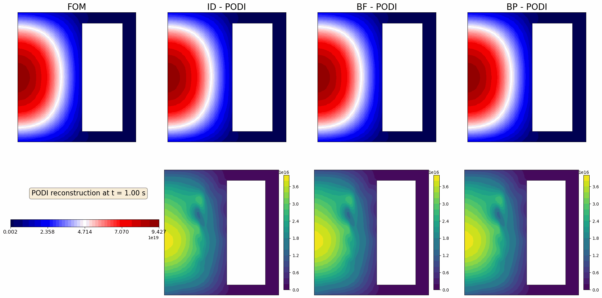
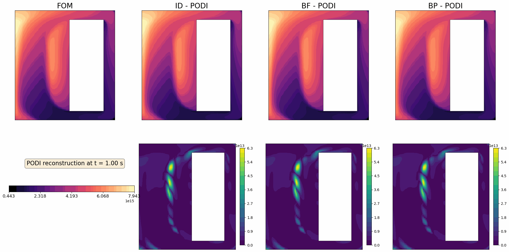
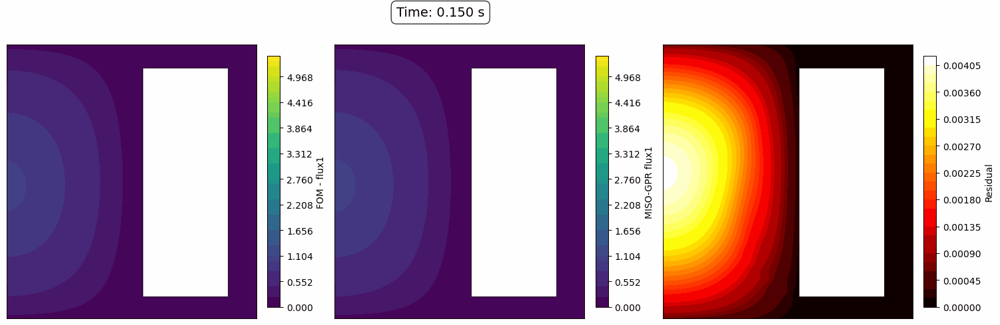
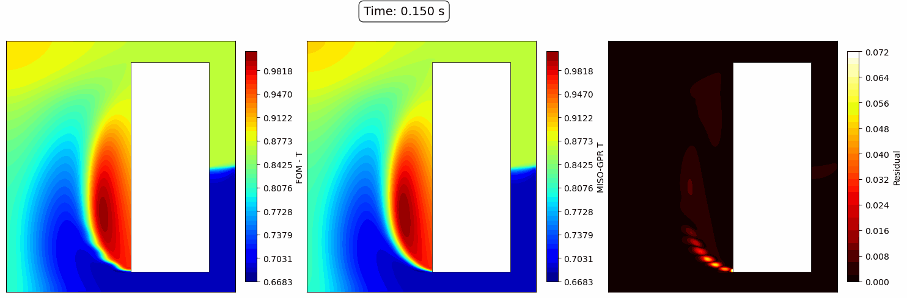

## Boundary Sensing
Comparison of 3 different sensor placement strategies (ideal ID, full boundary BF, and partial boundary BP).

<figure style="display: inline-block; margin: 10px;">
  
  <figcaption style="text-align: center;">(a) Velocity </figcaption>
</figure>

<figure style="display: inline-block; margin: 10px;">
  
  <figcaption style="text-align: center;">(b) Flux </figcaption>
</figure>

<figure style="display: inline-block; margin: 10px;">
  
  <figcaption style="text-align: center;">(c) Precursor 6 </figcaption>
</figure>

## Reflection Sensing

<figure style="display: inline-block; margin: 10px;">
  
  <figcaption style="text-align: center;">(a) Velocity </figcaption>
</figure>

<figure style="display: inline-block; margin: 10px;">
  
  <figcaption style="text-align: center;">(b) Flux 1 </figcaption>
</figure>

<figure style="display: inline-block; margin: 10px;">
  
  <figcaption style="text-align: center;">(c) Temperature (observable) </figcaption>
</figure>
