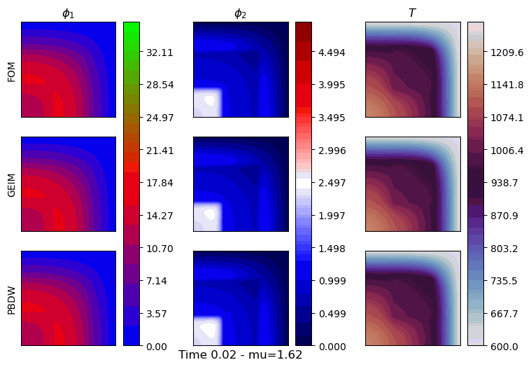

## Linearised Coupling

TR-GEIM and PBDW are compared in the context of model bias correction for multi-physics models of nuclear reactors, starting from a weakly coupled full order model.

<figure style="display: inline-block; margin: 10px;">
  
</figure>

