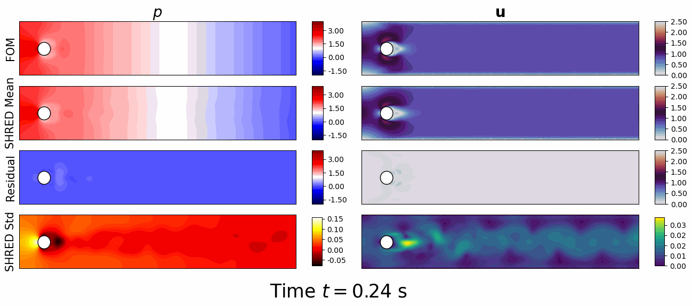
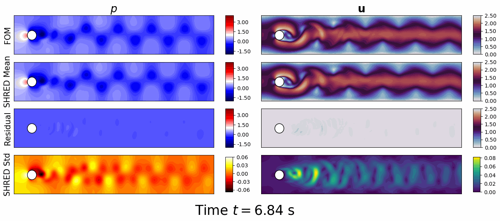
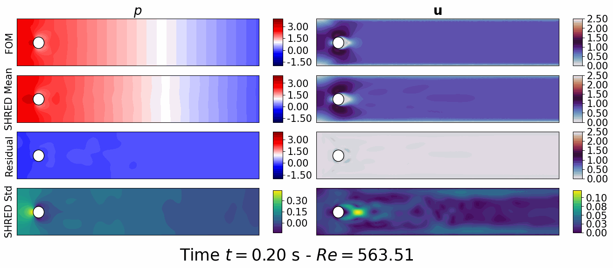

## Flow Over Cylinder

A first analysis of SHRED to study the flow over a cylinder is presented, in three different modes: reconstruction, prediction and parametric reconstruction.

<figure style="display: inline-block; margin: 10px;">
  
  <figcaption style="text-align: center;">(a) Reconstruction </figcaption>
</figure>

<figure style="display: inline-block; margin: 10px;">
  
  <figcaption style="text-align: center;">(b) Prediction </figcaption>
</figure>

<figure style="display: inline-block; margin: 10px;">
  
  <figcaption style="text-align: center;">(c) Parametric </figcaption>
</figure>
